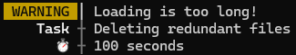

# @daldalso/logger
Fancy logging library using tagged template literal

## Getting Started
1. `yarn add @daldalso/logger`
2. `import { log } from "@daldalso/logger"`
3. `log("Hello, World!")`

Full examples are shown in [example.ts](src/example.ts).

## Usage
### Log levels
There are 5 built-in log levels below, and you can directly call them to log something.
- `log`
- `info`
- `success`
- `warning`
- `error`


```js
import { log, info, success, warning, error } from "@daldalso/logger";

log("Log");
info("Info");
success("Success");
warning("Warning");
error("Error");
```

### Colors
There are 36 styles of decorating text and you can call `col` to use them.


```js
import { col, log } from "@daldalso/logger";

log(col.red`Red`);
log(col.bgBlue`Blue`);
```

You can make a call chain to apply multiple styles.


```js
import { col, log } from "@daldalso/logger";

log(col.italic.green`Italic and green`);
log("🚗💨 " + col.yellow.bgLBlack.underline`─────`);
```

### Tagged template literal
The five functions can also be used as tagged template literals.
In this case, expressions are handled depending on their type.
For example, ```log(`Data: ${{ foo: 1 }}`);``` converts `{ foo: 1 }` to a string and prints "Data: [object Object]", but ```log`Data: ${{ foo: 1 }}`;``` treats it as an object and prints:


When you want to print just an object without any template literals, call `log(object)` and it would be handled as its type.

### Values
Most of object types are handled for better appearance.


```js
import { log } from "@daldalso/logger";

log([ 1, 2, 3 ]);
log(new Map([ [ "foo", /bar/g ], [ log, true ] ]));
log(Promise.resolve("foo"));
```

> [!IMPORTANT]
>
> In a general way, retrieval of the state of `Promise`s can't be synchronous.
> To bypass the limit, Logger calls `Promise.race` with `Promise.resolve()` to check the state, which means logging a `Promise` is asynchronous.
>
> In the above example, switching the execution order of `log(new Map(...))` and `log(Promise.resolve("foo"))` won't change the result.

Object with circular references is marked as below:


```js
import { log } from "@daldalso/logger";

const circularObject = { foo: 1 };
circularObject.this = circularObject;
log(circularObject);

const circularArray = [ "bar" ];
circularArray.push(circularObject, circularArray);
log(circularArray);
```

### Labeling
When you call Logger with multiple arguments, it labels each argument with numbers like below:


```js
import { log } from "@daldalso/logger";

log("foo", "bar", "baz");
```

You can set the name of labels by calling any properties of its return value.



```js
import { warning } from "@daldalso/logger";

warning("Loading is too long!").Task("Deleting redundant files")['⏱️']("100 seconds");
```

### Styling
Logger's behavior can be configured by `Logger.instance.setOptions`.
Actually, the above screenshots are not from the result of its default options,
because the default options makes Logger print timestamps which are distracting for demonstration.


```js
import { Logger, info, log } from "@daldalso/logger";

Logger.instance.setOptions({
  headings: {
    [LogLevel.VERBOSE]: col.black.bgLBlack`(LOG)`,
    [LogLevel.INFO]: col.black.bgCyan`(INF)`
  },
  headerFormat: col.lMagenta`[main]` + " $T $H "
});

log("Hello, World!");
info("How are you?");
```

### Subscription
Logger calls `console.log` by default, but you can change this behavior with its subscription methods.

```js
import { Logger, log } from "@daldalso/logger";

Logger.instance.removeSubscriber(1); // Removes default subscriber
Logger.instance.addSubscriber(
  (_, value) => console.error(value),
  { colored: true }
);
log("Hello, World!"); // This will be printed to stderr.
```

There are some functions that return a subscriber.

```js
import { Logger, log, createDirectorySubscriber } from "@daldalso/logger";

Logger.instance.addSubscriber(
  createDirectorySubscriber("logs", { type: "time", interval: "daily" }),
  { colored: false } // Removes color data
);
log("Hello, World!"); // This will be printed to both stdout (by default) and a log file.
```

### Instantiation
You can instantiate Logger to apply different configuration.
Note that the instantiated Logger does not have any subscribers, which means you have to add one before logging with it.

```js
import { Logger, createFileSubscriber } from "@daldalso/logger";

const fileLogger = new Logger({
  headerFormat: "$H "
});
fileLogger.addSubscriber(
  createFileSubscriber("example.log"),
  { colored: false }
);
fileLogger.verbose("Hello, World!"); // This won't be printed to stdout.
```